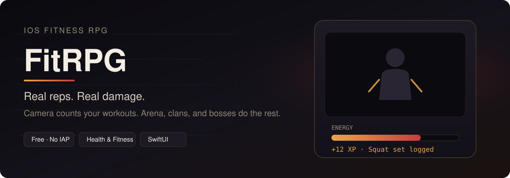
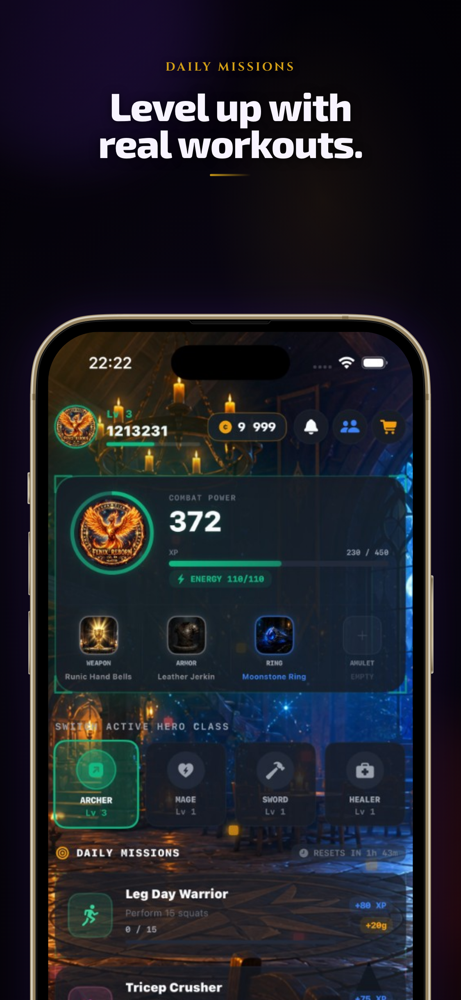
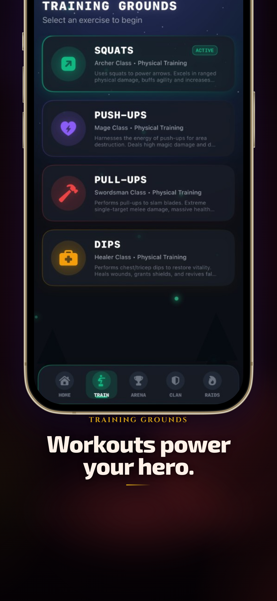
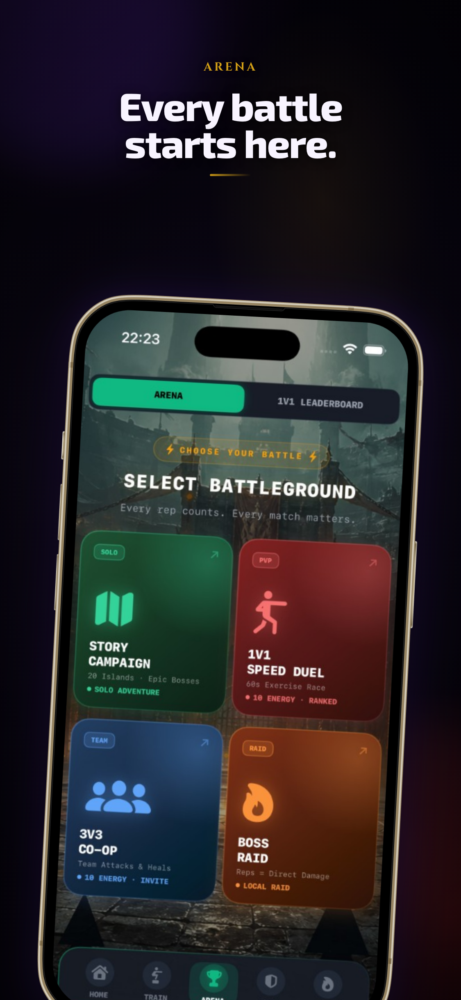
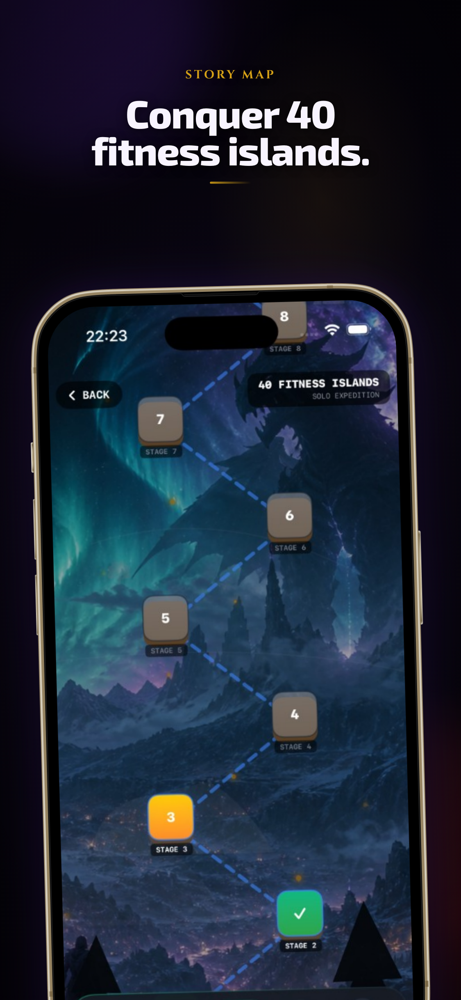
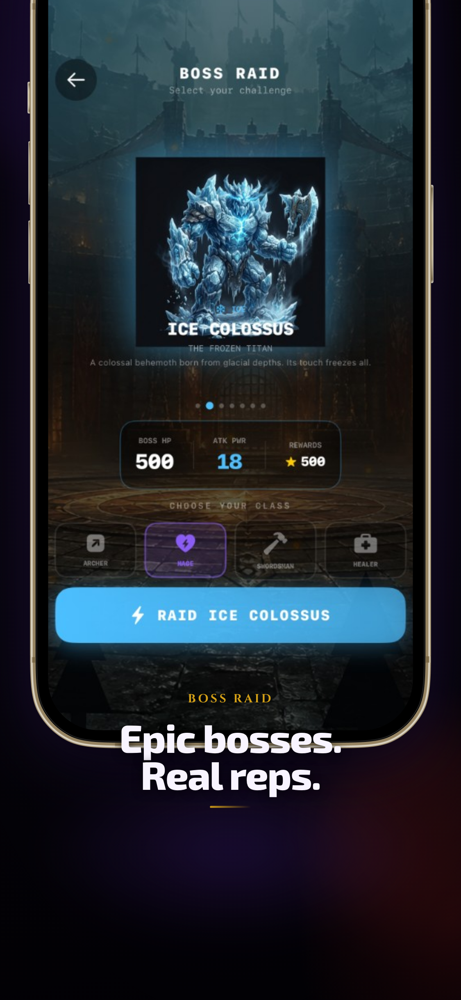
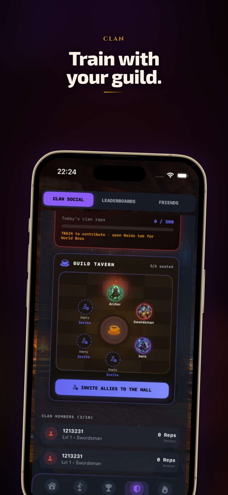

<p align="center">
  
</p>

<p align="center">
  <strong>FitRPG</strong> turns bodyweight training into RPG combat.<br/>
  Camera-tracked reps fuel your hero. Fight in Arena, raid with your clan, clear fitness islands.<br/>
  <em>Free. No IAP.</em>
</p>

<p align="center">
  <a href="https://borisserz.github.io/fitrpg-legal/index.html"></a>
  <a href="https://borisserz.github.io/fitrpg-legal/privacy.html"></a>
  <a href="marketing/ASO-FitRPG-ASC-2026-07-29.md"></a>
  
  
</p>

---

## What it is

FitRPG is an iOS fitness RPG: you do the work, the camera counts the reps, and the game turns that effort into combat power. Frames stay on device. Gold and gear come from play — not a paywall.

> **RU:** FitRPG — фитнес-RPG для iPhone: камера считает повторения, герой получает силу, дальше Arena, кланы и боссы. Бесплатно, без IAP.

**Repo note:** GitHub remote is still `rpg-fitness`; product name is **FitRPG** (`com.borisdev.rpg-tracker`).

---

## Screenshots

Framed App Store creatives (English). Full device set lives in [`marketing/ASC-UPLOAD/`](marketing/ASC-UPLOAD/).

| Home | Train | Arena |
|:---:|:---:|:---:|
|  |  |  |

| Islands | Boss | Clan |
|:---:|:---:|:---:|
|  |  |  |

---

## Features

- **Camera rep tracking** — squats, push-ups, and more; processing on device
- **Hero progression** — XP, energy, gear tied to real sets
- **Arena & matchmaking** — PvP powered by your training
- **Clans & raids** — fight bosses together
- **Fitness islands & dungeons** — quest-style workout loops
- **HealthKit** — optional health data where the app requests it
- **Firebase multiplayer** — auth, Firestore, Cloud Functions, App Check

No subscriptions. No IAP. Promotional copy for ASC says the same.

---

## Stack

| Layer | Tech |
|--------|------|
| Client | SwiftUI · HealthKit · Camera / Vision |
| Backend | Firebase Auth · Firestore · Cloud Functions · App Check · Remote Config |
| Legal / store pages | [`fitrpg-legal/`](fitrpg-legal/) → [GitHub Pages](https://borisserz.github.io/fitrpg-legal/) |
| Marketing tooling | Next.js screenshot editor under [`marketing/app-store-screenshots/`](marketing/app-store-screenshots/) |

---

## App Store / ASC

| Item | Status / location |
|------|-------------------|
| Bundle | `com.borisdev.rpg-tracker` · Apple ID `6785639478` |
| Store name (target) | `FitRPG: Fitness Workout RPG` |
| Categories | Primary **Health & Fitness** · Secondary **Games → Role Playing** |
| Pricing | Free · **No IAP** |
| Paste package | [`marketing/ASO-FitRPG-ASC-2026-07-29.md`](marketing/ASO-FitRPG-ASC-2026-07-29.md) |
| Screenshot drop folder | [`marketing/ASC-UPLOAD/`](marketing/ASC-UPLOAD/) (+ [`README.txt`](marketing/ASC-UPLOAD/README.txt)) |
| Privacy / Support | [Privacy](https://borisserz.github.io/fitrpg-legal/privacy.html) · [Support](https://borisserz.github.io/fitrpg-legal/support.html) |

Operator tip: upload primary slots first — **iPhone 6.9"** and **iPad 13"** — then fill other sizes if ASC asks.

---

## Marketing assets

```text
marketing/
├── ASO-FitRPG-ASC-2026-07-29.md   # name, subtitle, keywords, description, review notes
├── ASC-UPLOAD/                    # framed PNGs ready for App Store Connect
│   ├── iPhone/{6.9,6.5,6.3,6.1}-inch/
│   └── iPad/{13,12.9}-inch/
└── app-store-screenshots/         # local editor to regenerate framed shots
```

Open the ASC folder in Finder:

```bash
open marketing/ASC-UPLOAD
```

Run the screenshot editor (optional):

```bash
cd marketing/app-store-screenshots
npm install
npm run dev
```

---

## Develop (iOS)

1. Open `rpg-tracker/rpg-tracker.xcodeproj` in Xcode.
2. Use your team signing + a valid `GoogleService-Info.plist` (gitignored — keep it local).
3. **Simulator + App Check:** DEBUG builds use the App Check debug provider. Register the console UUID under Firebase Console → App Check → Manage debug tokens, or set `FirebaseAppCheckDebugToken` in the Run scheme. Callables enforce App Check; without a registered token you will see 401 / permission errors in shop and match flows.
4. Build & run on a device for camera tracking; Simulator is fine for UI and multiplayer plumbing once App Check is set up.

Backend / Functions live under the Firebase project wiring already used by the app (see `.agents/knowledge/` operator checklists).

---

## Repo map

| Path | Role |
|------|------|
| `rpg-tracker/` | FitRPG iOS app |
| `functions/` | Cloud Functions |
| `fitrpg-legal/` | Privacy, terms, support, marketing pages |
| `marketing/` | ASO + ASC screenshots + editor |
| `.agents/knowledge/` | Operator / audit knowledge cards |

---

## License & contact

Copyright 2026 Boris Serzhanovich. Store-facing legal pages: [`fitrpg-legal/`](fitrpg-legal/).

Questions for Review / support: see [Support](https://borisserz.github.io/fitrpg-legal/support.html).
